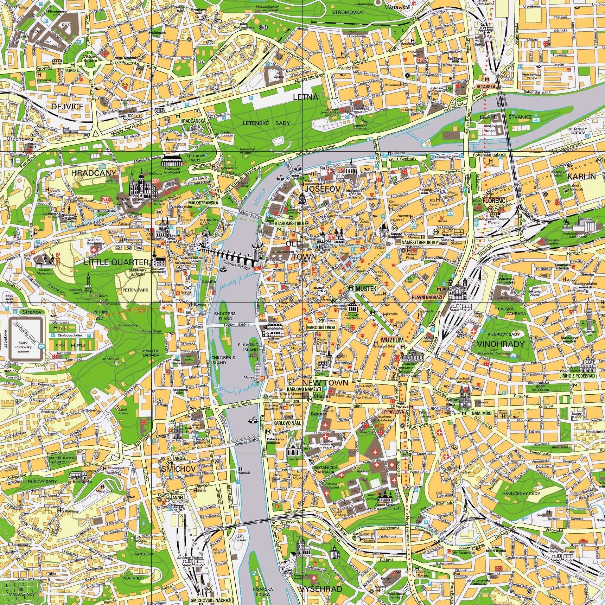

# Apéndice

## Recursos para aprender checo
***
Por último, aquí te dejo algunos recursos que puedes emplear en los tiempos muertos durante tu estancia. 

- [DUOLINGUO](https://es.duolingo.com/)
- [CZLT](https://czlt.cz/)
- [BLOG MUNDO CHECO](https://mundocheco.blogspot.com/2011/03/aprende-pronunciar-el-checo-en-una-hora.html#:~:text=Aprende%20a%20pronunciar%20el%20checo%20en%20una%20hora,de%20hecho%2C%20se%20llama%20igual%20%C4%8De.%20M%C3%A1s%20elementos)

- [LISTA DE PODCAST PARA APRENDER CHECO](https://www.alllanguageresources.com/czech-podcasts/)
- [CANAL YOUTOUBE CHECO PARA PRINCIPIANTES](https://www.youtube.com/watch?v=BT1UUWG7o4g)
- [CANTA CANCIONES EN CHECO](https://es.video.search.yahoo.com/search/video?fr=mcafee&ei=UTF-8&p=CZECH+FAMOUS+SONG&type=E211ES885G91806&guccounter=1#id=&vid=&action=close)

## Mapa de Praga
***
Aquí tienes además disponibles un par de mapas de Praga que puedes imprimir o bien consultar directamente desde aquí.

¡Te deseo una estupenda estancia en Praga!
