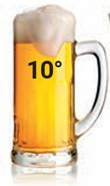

# Jdeme do restaurace / Vamos al restaurante
## Jak si objednat pivo? / ¿Cómo se pide una cerveza?
[1]:<https://www.youtube.com/watch?v=BxdkOhvxx50&list=PLIsod3TXTdoIUWJuKy4QR93eSfciCwFBX&index=8>
[2]:<https://www.youtube.com/watch?v=eJUSbxAet6k&list=PLIsod3TXTdoIUWJuKy4QR93eSfciCwFBX&index=9>
***
### **SLOVNÍČEK/VOCABULARIO**

|  |  |  |  |  |
|-----------------------------|---------------------------------|-----------------------------------|-------------------------------|---------------------------------|
| 1. **desítka**                 | 2. **dvanáctka**                   | 3. **jedenáctka**                    | 4. **malé pivo**                 | 5. **velké pivo**                  |
***
### **1.1 Podívejte se na [video][1] a odpovězte / Mira  el vídeo y completa.**
##### David si dá ________________ 
##### Amy si dá ________________
***
### **1.2 Doplňujeme / Añade lo que falta viendo este [video][2].**
##### • A: Tak, ta dvanáctka?
##### • B: Dvanáctku prosím ________ .
##### • C: A desítku sem, prosím.
##### • A: Chcete si už ____________?
##### • B: Ještě ____________ prosím.(…)
##### • B: Tak na zdraví!
##### • _____________________ !
##### • B: Tak co, jaké je to pivo?
##### • C: Většinou pivo __________________ , ale české pivo _________, je moc dobré
##### • B: A taky je __________ !
##### • C: To máš ___________ .(…)
##### • A: Tak co si dáte?
##### • C: Já mám dnes ____________na pizzu.
##### • A: A ___________ si dáte?
##### • C: Dám si tu _____________
##### • B: A já si dám smažené ____________ prosím. Ahranolky.
##### • A: Dobře. A dáte si ještě pivo?
##### • B: Ano, __________________.
***
### **Řešení / Soluciones.**
##### **1.1**

##### **Servírka**: Dobrý den.
##### **Amy a David**: Dobrý den.
##### **Servírka**: Tady máte jídelní lístek.
##### **David**: Děkujeme.
##### **Servírka**: Co si dáte k pití?
##### **David**: Dáme si pivo. Jaké máte?
##### **Servírka**: Máme desítku, jedenáctku a dvanáctku.
##### **David**: Dám si velkou dvanáctku, dnes mám velkou žízeň.
##### **Amy**: A já malou desítku
#### **1.2**
##### **Servírka**: Tak, ta dvanáctka?
##### **David**: Dvanáctku prosím sem.
##### **Amy**: A desítku sem, prosím.
##### **Servírka**: Chcete si už objednat?
##### **David**: Ještě moment, prosím.(…)
##### **David**: Tak na zdraví!
##### **Amy**: Na zdraví! (…)
##### **David**: Tak co, jaké je to pivo?
##### **Amy**: Většinou pivo nepiju, ale české pivo mám ráda, je moc dobré.
##### **David**: A taky je levné!
##### **Amy**: To máš pravdu.
##### **Servírka**: Tak co si dáte?
##### **Amy**: Já mám dnes chuť na pizzu.
##### **Servírka**: A kterou si dáte?
##### **Amy**: Dám si tu sýrovou.
##### **David**: A já si dám smažené kuře prosím. A hranolky.
##### **Servírka**: Dobře. A dáte si ještě pivo?
##### **David**: Ano, ještě jedno pivo prosím.

